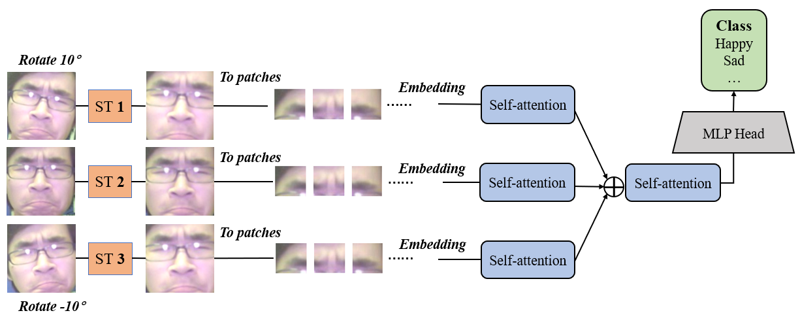

# DAtt_ViT

## Introduction
* This is a PyTorch implementation of DAtt_ViT

<p align="center">
  
</p>

## Datasets
* Oulu-CASIA:(https://www.oulu.fi/cmvs/node/41316)
* FER2013:(https://www.kaggle.com/c/challenges-in-representation-learning-facial-expression-recognition-challenge/data)
* CK+:(http://www.jeffcohn.net/Resources/)

## Prerequisites
To run this code, you need to have the following libraries:
* pytorch >= 1.1.0
* torchvision ==0.5.0
* opencv
* PIL
* numpy

## Usage
* Experiment in Fer2013 dataset:
```
python main_fer2013.py
```
  
* Experiment in Fer2013 dataset:
```
python main_oulu.py
```

* Experiment in CK+ dataset: